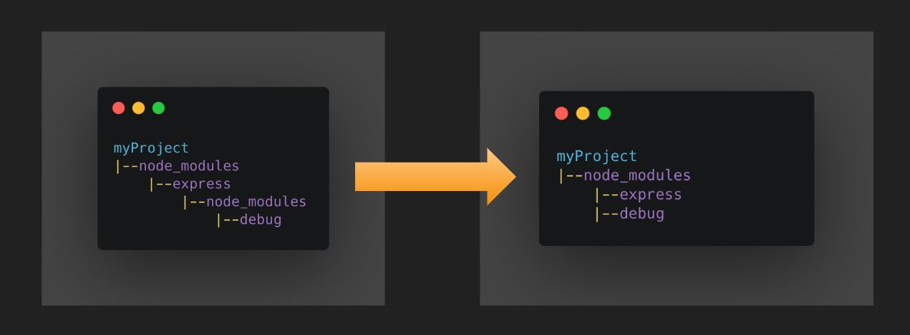

# Node.JS Project Engineering

The important frontend/nodejs projects' engineering knowledge.

## PNPM vs. Yarn/npm

[PNPM](https://pnpm.io/) is a **fast**, **disk space efficient** package manager, which works as counterpart of [Yarn](https://yarnpkg.com/) and NPM.

It aims to resolve the historic problems [phantom dependencies](https://rushjs.io/pages/advanced/phantom_deps/) and [NPM doppelgangers](https://rushjs.io/pages/advanced/npm_doppelgangers/) in node_modules. And it makes better time and space efficiency of node_modules.


### Dependency graph

In project management, the dependency graph is typical a [Directed Acyclic Graph](https://en.wikipedia.org/wiki/Directed_acyclic_graph) (aka DAG).

#### NodeJS special rule

NodeJS represents this graph physically on disk via file system. The tree could not represents the DAG well, so it introduces a [special resolution rule](https://nodejs.org/api/modules.html#modules_all_together) to help it with overheads of extra edges. But it will lead to **phantom dependencies** below.


#### [Phantom Dependency](https://rushjs.io/pages/advanced/phantom_deps/)
- A sample package.json
```json
{
  "name": "my-library",
  "version": "1.0.0",
  "main": "lib/index.js",
  "dependencies": {
    "minimatch": "^3.0.4"
  },
  "devDependencies": {
    "rimraf": "^2.6.2"
  }
}
```

- A sample script
```js
var minimatch = require("minimatch")
var expand = require("brace-expansion");  // ??? why
var glob = require("glob")  // ??? why
```

<details>
  <summary>Why ? Feature? Bug? </summary>

- `brace-expansion` and `glob` are dependencies of `rimraf`
- NPM has flattened their folders to be under my-library/node_modules 
  
  <details>
    <summary>Node flat mode since V3</summary>
  
  </details>


- Thus, it could be found by the NodeJS rule for "require".
  
These are **PHANTOM DEPENDENCIES**
  
  <details>
    <summary>So, impacts? </summary>

- Incompatible versions
  Your version of `glob` is not decided by your project, but by 3rd party `rimraf`.
  Upgrade lockfile could make you in trouble.
- Missing dependencies
  `rimraf` is a dev dependency, but `brace-expansion` is defined. 
  It could work in dev environment, but for production, it is missing in node_modules.

  </details>
</details>


#### Phantom `node_modules` Folder

Suppose we have a mono repo as the parent of the above lib.

- my-monorepo/package.json:
```js

{
  "name": "my-monorepo",
  "version": "0.0.0",
  "scripts": {
    "deploy-app": "node ./deploy-app.js"
  },
  "devDependencies": {
    "semver": "~5.6.0"
  }
}
```

- Then we have such directory
```
- my-monorepo/
  - package.json
  - node_modules/
    - semver/
    - ...
  - my-library/
    - package.json
    - lib/
      - index.js
    - node_modules/
      - brace-expansion
      - minimatch
      - ...
```

- What's going?
  You can call "semver" in `my-library` then.


<details>
  <summary>Look this rule!</summary>
<br/>
  
[NodeJS's rule](https://nodejs.org/api/modules.html#loading-from-node_modules-folders)

If the module identifier passed to `require()` is not a core module, and does not begin with `'/'`, `'../'`, or `'./'`, then Node.js starts at the parent directory of the current module, and adds `/node_modules`, and attempts to load the module from that location. Node.js will not append node_modules to a path already ending in node_modules.

If it is not found there, then it moves to the parent directory, and so on, until the root of the file system is reached.

For example, if the file at `'/home/ry/projects/foo.js'` called `require('bar.js')`, then Node.js would look in the following locations, in this order:

- /home/ry/projects/node_modules/bar.js
- /home/ry/node_modules/bar.js
- /home/node_modules/bar.js
- /node_modules/bar.js
    
> It can sometimes find node_modules folders that aren’t even under your Git working directory!
    
</details>


---

### PNPM's node_modules directory

<details>
  <summary>This is a sample <b>node_modules</b> of PNPM: </summary>
  
</details>

<details>
  <summary>Corresponding PNPM directory: </summary>
  
</details>


