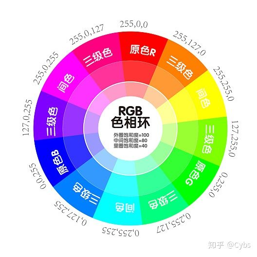

# Color Science 101

### 1. Color basic 

What is color? How we describe color?

- Color display spectrum

- [Trichromacy](https://en.wikipedia.org/wiki/Trichromacy)

  The Human's retina contains three types of color receptors (called cone cells in vertebrates) with different absorption spectra.
  
  We say S-cone, M-cone, L-cone, and they are activated by blue, green and red.
  
  
  
  They just like filter for lights.

- [Metamerism(同色异谱)](https://en.wikipedia.org/wiki/Metamerism_(color))

  Color is a biological phenominon. Now that human has only three color filters for nature lights, it means that some different combinations of lights could result in the same received waves in human's brains. 
  
  It is like this:
  
  

    
Metamerism spectrum example sample

    
    
  

- The color *Purple (magenta)* does not exist?

  We see the color wave length is linear, increasing from blue to red. But there are some colors exist between blue and red. Why?
  
  Theoretically, magenta between purple and red does not exist in nature color. It's a "imagine color" by our brain. It makes hue a ring. See more in [color space](#) section.
  
  

### 2. Color Vision 

###

### 3. Color Model 

#### 3.1 RGB

Red, Green, Blue.

- Additive color (mixing)

  

  Additive color models are applied in the design and testing of electronic displays that are used to render realistic images containing diverse sets of color using phosphors that emit light of a limited set of primary colors. 

#### 3.2 CYMK 

Cyan, Yellow, Magenta, **blacK**.

- Subtractive color (mixing)
  
  

  This idealized model is the essential principle of how dyes and inks are used in color printing and photography where the perception of color is elicited after white light passes through microscopic "stacks" of partially absorbing media allowing some wavelengths of light to reach the eye and not others.

#### 3.3 HSL/HSV

##### a. Hue

- Newton's color circle:

- Hue ring

##### b. Saturation

### 4. Color Space and Gamut 

#### 4.1 CIE 1931

[CIE 1931 color space](https://en.wikipedia.org/wiki/CIE_1931_color_space) are the first defined quantitative links between distributions of wavelengths in the electromagnetic visible spectrum, and physiologically perceived colors in human color vision. The mathematical relationships that define these color spaces are essential tools for color management, important when dealing with color inks, illuminated displays, and recording devices such as digital cameras. 

  
CIE 1931 RGB color matching functions 

  
  
  
It describes the how to mix up the visible colors in different wave length using RGB, to match what human can see.

  
The negative value means that mixing RGB could not present the target color at postive values. Then we mix color to target color to match back the test color and we subtract the value added to target color from the tested one.

  
The CIE 1931 color space chromaticity diagram 

  

 
#### 4.2 Color Space

  
Tooltips of reading colorspace graph

  

- sRGB
  
  sRBG, AKA standard RGB is the most widely adopted color space today. 
  
  - Common moditor RGB standard. Other color devices simulate that monitor by calibration.
  - Morden browser standard now support sRGB only. 
  - Gamut is limited. Tag "&lt;canvas&gt;" are discussed to support more wild gamut

- AdobeRGB

#### 4.3 Gamut

[Gamut](https://en.wikipedia.org/wiki/Gamut) is the set of chromaticities generated by a set of color primaries, 

Different color spaces represent different ranges of color.

- Delta E

### References

- [The basics of color and color management](https://www.youtube.com/watch?v=fq-kNtwifFk&list=PLMsVycIbp_YsQVHP0CSjNDSBuaznyGC6l&index=3) @ [ColorPlaza TV](https://www.youtube.com/channel/UCIwTmFi6wFyHee9JNQ6YbTw)
- [Color WorkSpace: Using sRGB or AdobeRGB?](https://www.youtube.com/watch?v=UKfg8GtT75k) @ [ColorPlaza TV](https://www.youtube.com/channel/UCIwTmFi6wFyHee9JNQ6YbTw)
