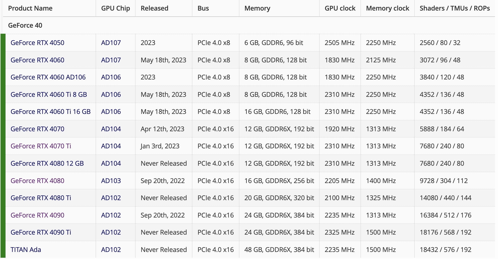
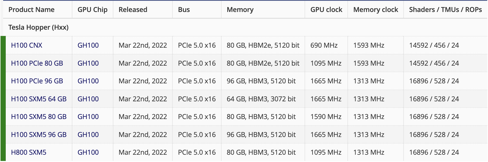

# Graphics Processing Unit

The infrastructure of modern technology topics (AI, Machine Learning, Blockchain, etc.)

---

## Story about NVidia

### History

### Product Series

Nvidia had many product series, now it has 3 main series:

- GeForce: Desktop, Gaming
  e.g. GeForce RTX 3090, GeForce RTX 4090.
- Quadro: Workstation
- Tesla: Data Center
  - See [Nvidia Tesla](https://www.nvidia.com/en-us/data-center/tesla/). e.g. H100, A100, V100, etc.
  - AWS Deep Learning instances are based on Tesla. See [AWS GPU Instances](https://docs.aws.amazon.com/dlami/latest/devguide/gpu.html)
- Others: Jetson, Ada, Tegra, etc.

## Introduce GPU

### Architecture

### How GPU works

### Compare with CPU

[CPU vs. GPU](https://www.intel.com/content/www/us/en/products/docs/processors/cpu-vs-gpu.html)

### Read GPU Spec

To better understand how the GPU performs, we should learn to read the spec of GPU of the core metrics.

We can find the centralized parameter specs of GPUs at the 3rd party: https://www.techpowerup.com/gpu-specs/

Or the details in the official website of the GPU manufacturer (NVidia, AMD, and Intel), e.g.

- [Intel Arc A770](https://www.intel.com/content/www/us/en/products/sku/229151/intel-arc-a770-graphics-16gb/specifications.html)
- [AMD Radeon RX 7900 XTX](https://www.amd.com/en/products/graphics/amd-radeon-rx-7900xtx)
- [Nvidia Geforce RTX 4090](https://www.nvidia.com/en-us/geforce/graphics-cards/40-series/rtx-4090/)
- [Nvidia Tesla H100](https://www.nvidia.com/en-us/data-center/h100/)

#### Cores

> Similar as the CPU, the GPU has cores. The cores is used for parallel computing.
> Different from the CPU which has up-to 48 cores, the GPU has up-to 10,000 cores.

| Chip | Cores | Clock |
| ------ | ------ | ------ |
| [Intel Core i9-13900K](https://www.intel.com/content/www/us/en/products/sku/230496/intel-core-i913900k-processor-36m-cache-up-to-5-80-ghz/specifications.html) | 24 | 5.8 GHz (Turbo) |
| [AMD Ryzen 9 7950X3D](https://www.amd.com/en/products/apu/amd-ryzen-9-7950x3d) | 16 | 5.7 GHz (Boost) |
| [AMD 7900XTX](https://www.amd.com/en/products/graphics/amd-radeon-rx-7900xtx) | 6144 | 2.5 GHz (Boost) |
| [RTX 4070Ti](https://www.nvidia.com/en-us/geforce/graphics-cards/40-series/rtx-4070-4070ti/) | 7680 | 2.61 GHz (Boost) |
| [RTX 4090](https://www.nvidia.com/en-us/geforce/graphics-cards/40-series/rtx-4090/) | 16384 | 2.52 GHz (Boost) |
| [Tesla H100](https://www.nvidia.com/en-us/data-center/h100/) | 14592 | 1.845 GHz (Boost) |

##### Cuda Cores (Nvidia)

- [CUDA Cores](https://www.nvidia.com/en-us/geforce/technologies/cuda/): Nvidia

#### Bus, Clock & Memory

##### Bus

The bus is the connection between the GPU and the motherboard. It is the data highway between the GPU and the CPU.

- Bus type: PCIe 4.0, PCIe 5.0, etc.
    See [PCIe 4.0 vs 5.0](https://www.intel.cn/content/www/cn/zh/gaming/resources/what-is-pcie-4-and-why-does-it-matter.html)
- Bus channel: x16, x8, x4, etc.

- Bus width: 128-bit, 192-bit, 256-bit, 384-bit, etc.

##### Clock Speed

The clock speed is the speed of the GPU. (in MHz)

Just like the CPU. It contains the core clock speed and the memory clock speed.

##### Memory

The memory of GPU is called **VRAM** (Video RAM).

- Memory type & size
  - Type: GDDR5, GDDR6, GDDR6X, etc.
  - Size: Nowaday, the mainstream is 8GB, 12GB, 16GB, 24GB etc.
            Just like the RAM. The larger, the better. 🤣
            The larger VRAM support:
    - [Graphic] Higher quality textures (4K, 8K, etc.)
    - [Graphic] More complex geometry (higher poly count, tessellation, etc.)
    - [Deep Learning] Larger dataset and batch sizes
    - [Deep Learning] More complex and larger models

- Memory Bus Width & BandWidth
  - Bus Width: Or `Bit Width`, `Memory Interface Width`.
    It is the number of bits that can be transferred simultaneously.
  - Bandwidth: The overall width of the memory bus. It is the product of the bus width and the clock speed.
    - Formula: `Bandwidth = Bus Width * Clock Speed`
    - Unit: GB/s, e.g. 320 GB/s

#### Shader & TMU & ROP

For rendering pipeline:

- GPU shader works for the shader programs on-GPU computation.

- TMU stands for Texture Mapping Unit. It is a component of the video card or GPU that is responsible for mapping textures to polygons.

- ROP stands for Render Output Unit. It is a component of the video card or GPU that is responsible for writing the final pixel data to the frame buffer.

#### TFLOPS

TFLOPS (teraFLOPS) is the tera (10^12) **FL**oating point **O**perations **P**er **S**econd.

Generally, we say in 32-bit floating point.

> GFLOPS, as we can guess, is the giga (10^9) of FLOPS. It was used in years ago and now we are in TFLOPS era.

##### Cross-platform's battle of TFLOPS in their graphics core:

| Platform | TFLOPS |
| ------ | ------ |
| PS5    |  10.28 |
| XBOX Series X |  12.00 |
| Nintendo Switch | 0.4 / 0.5 (Docked) |
| Apple A17 Pro | 2.15 |
| Apple M2 Ultra (76 core) | 27.2 |
| Intel UHD Graphics 770 | 0.794 |
| Intel Iris Xe Graphics G7 96RUs | 1.690  |
| Intel Arc A770 | 19.66 |
| AMD Radeon RX 7800 XT | 37.32 |
| AMD Radeon RX 7900 XTX | 61.42 |
| GeForce RTX 2080 Ti | 13.45 |
| GeForce RTX 3090 | 35.58 |
| GeForce RTX 4070 Ti | 40.09 |
| GeForce RTX 4090 | 82.58 |
| Tesla H100 | 67 |

## Use GPU

