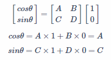
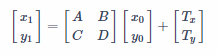
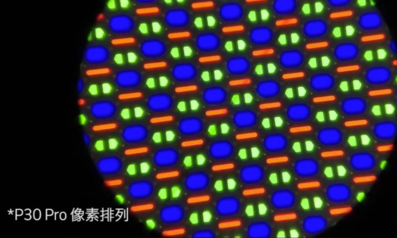
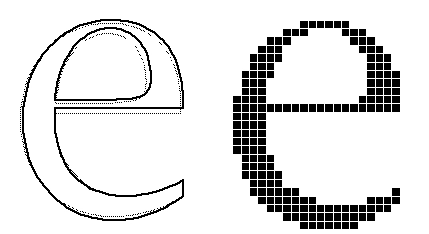
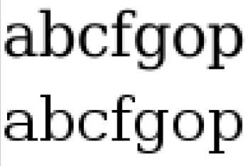

# Transformation & Rasterization

[TOC]

## Transformation

### Basic 2D transformations

- Scaling
  

    
Scale an image at x axis 

    
  
    
Each point (x0, y0) becomes (x1, y1) after scaling, then we define scaling matrix S(x,y): 

  
    
  

- Rotation
  

    
Rotate an image (origin point as center) 

    
    
Suppose the rotate matrix R(θ) has: 

    
  
    
<b>Prove: </b>

    
(1, 0) becomes (cosθ, sinθ)

    
    
(0, 1) becomes (-sinθ, cosθ)

    
  
    
Then, we have the definition of R 

    
  

- Linear transformation

  Scaling and rotation are both shown as a linear form of matrix. 
  

    
Linear transformation

    
    
  

- Translation

  

    
Translation is just the simple movement of the object in coordinate. 

    
    
  

### Homogeneous coordinates 

A translation is different from linear transformation. Now it must be two matrix for combining them:

  
A matrix with both linear transformation and translation.

  
  

But we want one matrix to express them together. Now we introduce a new tool: [homogeneous coordinates](https://en.wikipedia.org/wiki/Homogeneous_coordinates).

##### Defintion

To be simply, homogeneous coordinate works by adding an extra dimention to matrix, for describing higher dimention caused transformation, like projection. 
In other word, an n-dimention space will be described by n+1-dimention matrices. 

We are discussing 2D transformation, so we express them in ternary form:

- 2D point: (x, y, 1)
- 2D vector: (x, y, 0)

Accordingly, the transformation matrix will be 3D matrix as well: 

  
Transform matrix in homogeneous coordinates:

  

The homogeneous transform grants us the characteristics below: 

1. "w" value will not be changed for vectors.
  

    
Translate vector :

    
  

2. Vector + Vector = Vector
  - [x1, y1, 0] + [x2, y2, 0] = [x1 + x2, y1 + y2, 0]

3. Point - Point = Vector
  - [x1, y1, 1] - [x2, y2, 1] = [x1 - x2, y1 - y2, 0]

3. Point + Vector = Point
  - [x1, y1, 1] + [x2, y2, 0] = [x1 - x2, y1 - y2, 1]

##### Affine transformation

Applied homogeneous matrix, we have a transformation named "[Affine transformation](https://en.wikipedia.org/wiki/Affine_transformation)".

  
Affine transformation:

  

  
With this utility, we can have expression the above three transformations in homogeneous style: 

  

  
Of cource, the three transformations can be combined in one. 

### In practise

Affine transformation matrix for 2D transformation is useful. In UI interface for drawing element, we typically pass this matrix for apply trasformation.

In the 3D transformation matrix, the 3rd row will always be [0, 0, 1], it does not need to be told as parameter.

So the transformation matrix in 2D drawing functions will typically be like:

[A, B, C, D, Tx, Ty]

### For 3D

Affine transformation in 3D is just similar with 2D. Just make the transformation matrix to be 4D.

#### Viewing transformation

#### Viewport transformation

#### Project transformation

#### Perspective transformation

TBD

## Rasterization

### Resolution

- Images resolution
  

    
An image rendered in different resolution 

    
  

- Display resolution
  

    
The display resolution standard: 

    
  

- Native resolution
  The [native resolution](https://en.wikipedia.org/wiki/Native_resolution) of display devices are determined by the fixed physical pixels. On a fixed native resolution, you could set a equivalent or lower display resolution, or display a lower resolution images. It is about scaling. 
  
  Your graphics card sends an 800×600 image to a 1366×768 LCD, the display must interpolate (scale) the image to be larger and fill the screen. In the example here, the aspect ratios (4:3 for 800×600 and 16:9 for 1366×768) are different – so not only will the image be enlarged, the image will be distorted.
 
  - Bitmap are heavily impacted. Vectors will behave better.
  - The higher your native resolution is, the less side effect of scaling could be notified.
  - Suggest to use native resolution as display resolution. 
  
  

    
A 800*600 content sent to a native 1024*768. 

    
  

  

- Screen space
  

    
The digital screen space are described as a 2-dimension matrix. One unit is shown as one pixel. 

    
  

- Subpixel layout
  

    
One pixel is consist of RGB subpixels. It has different stripes layout in different display devices. 

    

    
P30 Pro

    

    
Google Nexus One

    
  

### Basic rasterization

What is [rasterization](https://en.wikipedia.org/wiki/Rasterisation)?  It is kind of a sampling.

An simple example: just imagine some colorful ink float on water, which show as a painting. Now we have a screen window, sink it under the water and slowly take it out.
Then we'll have a painted screen window, which is similar to rasterization.

[Bresenham's line algorithm](https://en.wikipedia.org/wiki/Bresenham%27s_line_algorithm) is the most basic rasterization algorithm for drawing lines (primitive, vector) as bitmaps.

  

    
Illustration of the result of Bresenham's line algorithm. 

    
  

- Step 1:
  

    
Put a geometric figure (like triangle) in the screen space. 

    
  

- Step 2:
  

    
Sampling: consider each pixel (center of pixel space) is inside or outside the triangle. 

    
  

- Step 3:
  

    
Use bounding box to reduce sampling area. 

    
  

- Step 4:
  

    
Get the pixels inside the triangle. 

    
  

- Step 5:
  

    
Display the color in those pixels to show the triangle. 

    
  

- Now we get a rasterized figure. But it is really jaggy. It could be improved by a higher resolutions. (See `MSPaint`)

### Antialiasing

#### Theory

- Bad "Sampling":
  

    
Antialising is just a sampling, a low frequency sampling on sharp images will get jaggy or [Moiré pattern](https://en.wikipedia.org/wiki/Moir%C3%A9_pattern) 

    
  

- How sampling frequency losses the original signal:
  

    
If your resolution is not that high, you should see a 'blurred' image. 

    
    
  

- Blurr image before sampling:
  

    
If your resolution is not that high, you should see a 'blurred' image. 

    
    
  

#### Antialisaing

- Use [low-pass filter](https://en.wikipedia.org/wiki/Low-pass_filter) to blur the filter the high frequency signals:
  

    
Use convolution (or average color in the unit). 

    
  

- SSAA/MSAA (Super/Multi-Sampling Anti-Aliasing):
  

    
Use a higher sampling ratio in single pixel.

    
  

  

    
Compare the different sampling effect. 

    
Use single sampling in pixel: 

    
    
Use multi-sampling in pixel: 

    
  

  

    
Convolution/Average to low resolution.

    
  

### Font rasterization

Refer to [Font rasterization on Wiki](https://en.wikipedia.org/wiki/Font_rasterization).

Fonts are now vectors, then they could be scaled from extreme small to very large. Rasterization for fonts are map a vector path to a pixel matrix.

Raw rasterized font without antialiasing:

  
Sample

  

#### Antialiasing in font

- Different antialias level

  - Basic antialias without hint
      

        
Sample

        
      

  - Antialias with hint
      

        
Sample

        
      

  - Subpixel rendering for an RGB flat panel
      

        
Sample

        
      

- [Font Hinting](https://en.wikipedia.org/wiki/Font_hinting)
  
  For the purpose of on-screen text display, font hinting designates which primary pixels are interpolated to more clearly render a font. 
  
  -> Font editors are able to do automatic hinting.
  
  -> High-quality commercial fonts are often manually hinted to provide the sharpest appearance.
  
    

      
Sample

      
    

  
- Subpixel rendering making white
      

        
Sample

        
      

- Morden font rasterization 

Nowadays, the most popular font rasterization library which supports both Windows and macOS is [FreeType](https://en.wikipedia.org/wiki/FreeType)

- Character 'e' in FreeType as small size with subpixel rendering.

  

    
Subpixel renered 'e'

  
  

---

### Raster (Bitmap) vs. Vector

  
Zooming raster vs. vector

  

#### Raster (bitmap)

  
Bitmap structure example: 

  

- [Raster](https://en.wikipedia.org/wiki/Raster_graphics) graphics, or bitmap image, is the most common repesentation of graphics which is a dot matrix data structure. 
- Typical formats: Jpeg, Png, WebP, Bmp, etc.
- Usage: photos, canvas.

#### Vector

- [Vector](https://en.wikipedia.org/wiki/Vector_graphics) graphics are defined in terms of of points on a Cartesian plane. 
- Typical formats: SVG, EPS, PDF, etc.
- Usage: geometry, design.

#### Comparison

When to use?

- For high resolution displays, vector graphics is more efficient. Raster graphics could be large when resolution is high. 
- For large amount of objects, raster graphics is more efficient. Vector graphics need store each object as a model but raster only stores the overall canvas. 

##### SVG vs. canvas

[SVG](https://en.wikipedia.org/wiki/Scalable_Vector_Graphics), AKA Scalable Vector Graphics, is XML-based vectir umage format if W3C since 1999.

[Canvas](https://en.wikipedia.org/wiki/Canvas_element) element, is part of HTML5 standard and allows for dynamic, scriptable rendering of 2D shapes and bitmap images. (Initialized by Apple in WebKit since 2004)

  
Performance comparison: 

  

